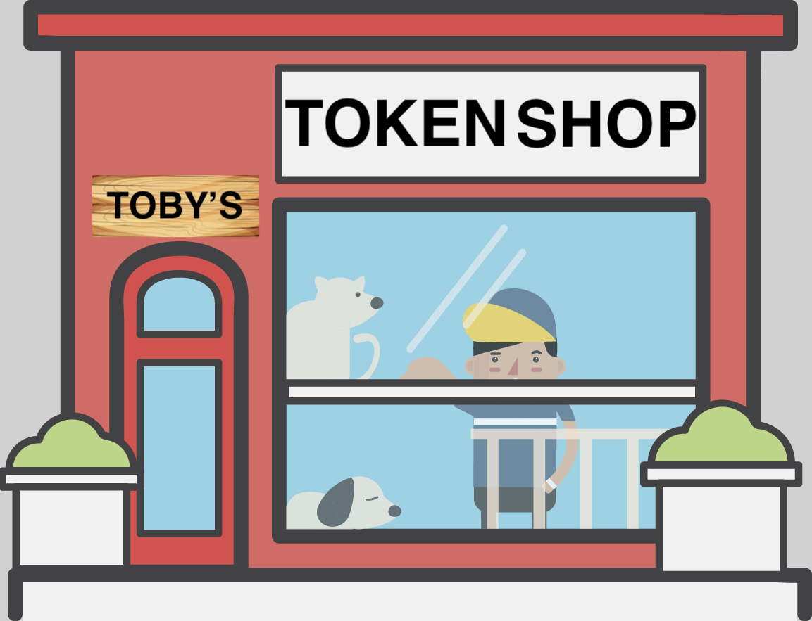

Title: Projects

# Projects

The following are some of the projects that I am working on, and actively maintain.

### <a href="https://smartpiggies.com target="new">SmartPiggies</a>

SmartPiggies is an open source standard for a peer-to-peer derivatives market. It is intended for use on public blockchains. The project was conceptualized in the fall of 2018. A proof-of-concept of the design described in the pink paper was built for EthDenver in Feburary 2019. Development of a platform to facilitate a smartpiggies marketplace is in current development.

--

### <a href="https://tokenshop.tobyjaguar.com" target="new">Token Shop</a>

TokenShop is a dApp that let's you buy Toby Tokens. Toby Tokens are Ethereum ERC-20 tokens (on mainnet and ropsten) that are redeemable in dollars from the bank of toby (i.e. me, if we meet in person). This is a social project exploring the token lifecycle with ERC-20 tokens, with the goal to complete transactions round trips for Toby Tokens. A user can buy Toby Tokens from the dApp for ether. 1 Toby Token costs $1 USD. You can buy more than a dollars worth (max $100) or less, but the tokens are purchased with ether. When we meet in person, I will reclaim the tokens in USD at the exchange rate of 1 Token = $1 USD. For reclamation you can burn them or transfer them to me or back to the shop. This is an exploration into stable tokens, with the intention of making round trips of users buying from the app, and reclaiming tokens for cash upon a personal meeting over a coffee and a good conversation. I have currently made two full transaction cycles to date. If you would like to participate there is still stock in the shop!

--

## <a href="https://telegram.me/gsbitbot" target="new">GSBitBot</a>

GSBitBot is a telegram bot that returns crypto prices including bitcoin, ethereum, gold, silver, as well as the bitcoin to ethereum ratio, and the gold to silver ratio. The price information is pulled from fixer.io.

I use this for personal price information, feel free to use it too, but there are no guarantees regarding performance. If the bot is down, I will usually reset it within a day. I recently converted the codebase from Golang to NodeJS. Between the node convertion and only pulling price information from one data provider, the pricing isn't as dynamic but the overall app is much more stable. However, if you overwhelm the server, it will go down, so please don't :)

screenshot:

