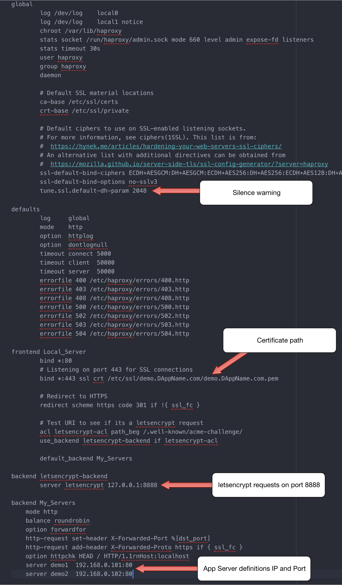

Title: Ah Ha Proxy
Date: 04/15/2019


## AH HA Proxy
*(Or, take on me a server that stays up)*

*(updated 04-20-2019)*


`(Photo by marc liu on Unsplash)`

Happy Tax Day! Thank you to the company that sent me a W2 a month and a half
after all tax documents were supposed to be mailed!

The purpose of this post is a bit of a reminder on how I set up HAProxy on
a Ubuntu 16.04 server, because it was a bit confusing, and hopefully it helps
someone else doing the same thing, or at the very least my future self.

We are running a demo for the 
<a href="https://www.smartpiggies.com/" target="new">SmartPiggies</a> 
DApp and continue to make it more stable. Last week someone on twitter asked to see
the DApp so I checked the link before sending it along. It was a good thing I
checked the link, because the server was not resolving the DApp! I thought someone
had breached the server and crashed it, as I was also not able to ssh into it.

I scrambled to spin up another Ubuntu server, upload the DApp, and switch the
DNS record. It was a nice trial by fire to see how fast I can do that, but a
ridiculous task to undertake. The DApp is just a demo we are using internally
and to date not something we advertise to the public. However when we want to
show it off, it helps if it works.

As it turns out, the server being down wasn't my fault nor had it anything to
do with the box getting Pwned; the hosting company made the mistake that took
down all of my servers. Yay, win!

In thinking of making the server hosting the DApp more robust I considered making
a redundant server to function as a backup in case one server went down. We now
had two such redundant servers, the original one that went down and the new one
I just spun up. I just needed to put a load balancer in front of those servers.

One of the best load balancers out there is 
<a href="http://www.haproxy.org/" target="new">HAProxy</a>
and I spent my Sunday evening waiting for the first episode of GOT to start
researching how to put up HAProxy on Ubuntu 16.04 to function as a failover if
one of the servers went down.

This proved more difficult and annoying than I had hoped, which is the reason
for this post.

## Setting up HAProxy with two round robin servers

The goal: install HAProxy in front of two servers and switch between in case
one goes down.

What follows is what eventually ended up working for me.

HAProxy will be a load balancer switching between both servers in a round robin
scheme to distribute calls to either server. If one server is unresponsive, all
requests go to the server still running.

I used the directions specified in this 
<a href="https://tecadmin.net/how-to-setup-haproxy-load-balancing-on-ubuntu-linuxmint/" target="new">tecadmin</a>
article to setup HAProxy.

```
sudo add-apt-repository ppa:vbernat/haproxy-1.8
sudo apt-get update
sudo apt-get install haproxy
```

Another article suggested coordinating server names.
This meant editing the /etc/hosts file on the HAProxy server with the names of the DApp
server IPs and names:

`192.168.0.101 demo1.server.com demo1`

`192.168.0.102 demo2.server.com demo2`

and also editing the /etc/hosts file on the respective DApp servers:

for demo1 -

`192.168.0.100 loadbalancer`

Once the server names were coordinated, the configuration file for HAProxy needs
to be setup for the server declarations

`sudo vim /etc/haproxy/haproxy.cfg`

I left the default global settings in tact and added the definitions for the
frontend and backend:

```
frontend Local_Server
  bind *:80
  default_backend Web_Servers
```

backend:

```
backend Web_Servers
  mode http
  balance roundrobin
  option forwardfor
  http-request set-header X-Forwarded-Port %[dst_port]
  http-request add-header X-Forwarded-Proto https if { ssl_fc }
  option httpchk HEAD / HTTP/1.1rnHost:localhost
  server demo1  192.168.0.101:80
  server demo2  192.168.0.102:80
```

then checking the config for errors with:

`haproxy -c -f /etc/haproxy/haproxy.cfg`

is it returns valid, then we are good to go.

I used systemd to manage the process with:

`sudo systemctl restart haproxy`

rather than the `service` command detailed in the article.

That wasn't so bad right? Switch the DNS record to the IP of the HAProxy server
and each DApp server gets used, rotating round robin for each request. If one
server goes down, the DApp still resolves from the other server. Great!

Now the team asks if we should have https on the DApp. That seems like a good idea,
especially as not to scare people away when we invite them to try out the demo.

So, ssl for this setup. How does one do that? Should be easy. Well, almost.

## Setting up certbot with HAProxy

<a href="https://certbot.eff.org/" target="new">Certbot</a> 
is great and pretty easy to setup on http
servers like Apache and Nginx, so it should be easy with HAProxy.

It turns out that there is a bit more setup than installing certbot with the Apache
or Nginx module.

This was the annoying part and the primary reason for the post.

The foundational directions for the implementation I went with comes from a
<a href="https://serversforhackers.com/c/letsencrypt-with-haproxy" target="new">serversforhackers</a> 
article describing the setup.

For this setup the cert goes on the HAProxy server not the DApp servers, as the
encrypted connection is made with the HAProxy server.

Installing certbot on the HAProxy server:

```
sudo add-apt-repository -y ppa:certbot/certbot
sudo apt-get update
sudo apt-get install -y certbot
```


Here is one trick in the directions, the haproxy config file needs to be updated
before the new certificates are made:

```
# LE Backend
backend letsencrypt-backend
    server letsencrypt 127.0.0.1:8888
```


Here a second internal backend server is defined that will listen to port 8888
when it receives letsencrypt requests. This would be defined just under the
frontend "Local_Server" section to look like:

```
frontend Local_Server
  bind *:80
  default_backend Web_Servers

# LE Backend
backend letsencrypt-backend
  server letsencrypt 127.0.0.1:8888

backend Web_Servers
  mode http
  balance roundrobin
  option forwardfor
  http-request set-header X-Forwarded-Port %[dst_port]
  http-request add-header X-Forwarded-Proto https if { ssl_fc }
  option httpchk HEAD / HTTP/1.1rnHost:localhost
  server demo1  192.168.0.101:80
  server demo2  192.168.0.102:80
```

Then make a new certificate:
```
sudo certbot certonly --standalone -d demo.scalinglaravel.com \
    --non-interactive --agree-tos --email admin@example.com \
    --http-01-port=8888
```

alternative flags include:

```
certbot certonly --standalone --agree-tos --non-interactive \
-m yourmail@host.org -d domain --preferred-challenges http \
--http-01-port=8888 --renew-with-new-domains \
--keep-until-expiring
```

Next the HAProxy config file needs to be updated with the frontend designation
for requests on the ssl default port 443:

`bind *:443 ssl crt /etc/ssl/demo.scalinglaravel.com/demo.scalinglaravel.com.pem`

where `/etc/ssl/demo.scalinglaravel.com/demo.scalinglaravel.com.pem`

will be made next with the combined certs that certbot previously made with the
command:

```
sudo certbot certonly --standalone -d demo.scalinglaravel.com \
    --non-interactive --agree-tos --email admin@example.com \
    --http-01-port=8888
```

demo.scalinglaravel.com is the server name from the article and
demo.scalinglaravel.com.pem is the combined cert that will be made next.

Two additional lines need to be included under `bind *:443`

```    
  acl letsencrypt-acl path_beg /.well-known/acme-challenge/
  use_backend letsencrypt-backend if letsencrypt-acl
```

these have to do with checking to see if the URI is requesting letsencrypt.

Next, generate a new certificate:

 `sudo certbot renew --tls-sni-01-port=8888`

 this is the same port listed in all the directions above. The port number
 doesn't necessarily matter, but the same port should be designated in all
 instances above.

 Then the directory listed in the HAProxy config for the ssl certificate needs to
 be made:

 `sudo mkdir -p /etc/ssl/demo.scalinglaravel.com`

Then combine the certificates that certbot made:

```
sudo cat /etc/letsencrypt/live/demo.scalinglaravel.com/fullchain.pem \
    /etc/letsencrypt/live/demo.scalinglaravel.com/privkey.pem \
    | sudo tee /etc/ssl/demo.scalinglaravel.com/demo.scalinglaravel.com.pem
```

This command failed to write the `privkey` file into the combined file, and the
command to check the config failed for me:

`haproxy -c -f /etc/haproxy/haproxy.cfg`

I finally had to run the above command and then run:

```
sudo cat /etc/letsencrypt/live/demo.scalinglaravel.com/privkey.pem >> sudo
/etc/ssl/demo.scalinglaravel.com/demo.scalinglaravel.com.pem
```
*(that's all one command)*

This put all the certs into the one file.

Note that `demo.scalinglaravel.com` is the name used in the article, for this post
it could be `demo.dappURL.com` or what ever DNS record the ssl certificate was
made for.

To be explicitly clear if the site for the DApp was `demo.DAppName.com`, the
cert would be made for `demo.DAppName.com` and the directory defined in the
haproxy.cfg configuration file would be listed as:

`bind *:443 ssl crt /etc/ssl/demo.DAppName.com/demo.DAppName.com.pem`

The HAProxy configuration file at `/etc/haproxy/haproxy.cfg` would then look similar
to:

```
frontend fe-scalinglaravel
    bind *:80

    # This is our new config that listens on port 443 for SSL connections
    bind *:443 ssl crt /etc/ssl/demo.DAppName.com/demo.DAppName.com.pem

    # New line to test URI to see if its a letsencrypt request
    acl letsencrypt-acl path_beg /.well-known/acme-challenge/
    use_backend letsencrypt-backend if letsencrypt-acl

    default_backend be-scalinglaravel

# LE Backend
backend letsencrypt-backend
    server letsencrypt 127.0.0.1:8888

# Normal (default) Backend
# for web app servers
backend be-scalinglaravel
    # Config omitted here
```

I received an error once the cert was loaded by HAProxy which stated:

`Setting tune.ssl.default-dh-param to 1024 by default, if your workload permits it you should set it to at least 2048`

I ended up adding the following to the HAProxy configuration file:

```
global
    log /dev/log    local0
    log /dev/log    local1 notice
    chroot /var/lib/haproxy
    stats socket /run/haproxy/admin.sock mode 660 level admin expose-fd listeners
    stats timeout 30s
    user haproxy
    group haproxy
    daemon

    # Default SSL material locations
    ca-base /etc/ssl/certs
    crt-base /etc/ssl/private

    # Default ciphers to use on SSL-enabled listening sockets.
    # For more information, see ciphers(1SSL). This list is from:
    #  https://hynek.me/articles/hardening-your-web-servers-ssl-ciphers/
    # An alternative list with additional directives can be obtained from
    #  https://mozilla.github.io/server-side-tls/ssl-config-generator/?server=haproxy
    ssl-default-bind-ciphers ECDH+AESGCM:DH+AESGCM:ECDH+AES256:DH+AES256: \
     ECDH+AES128:DH+AES:RSA+AESGCM:RSA+AES:!aNULL:!MD5:!DSS
    ssl-default-bind-options no-sslv3
    tune.ssl.default-dh-param 2048

    # Config omitted here
```

To get rid of the warning for `tune.ssl.default-dh-param` the parameter was added
at the end of the global settings:

`tune.ssl.default-dh-param 2048`

with the parameter `2048`.

The above configuration allowed for a load balancer that handles a server failure
which will resolve https requests to the DApp servers.

A complete version (edited for publication) looks like this:



HAProxy does want to be enabled on boot either by setting the default init
script by adding:

```
ENABLED=1
```

to the `/etc/default/haproxy` file or by enabling the service with:

```
sudo systemctl enable haproxy
```

Once this is done HAProxy will restart on a reboot.

I hope this helps anyone who might be looking for a similar solution, particularly
with cerbot and HAProxy.

If any of the above information is inaccurate please find me on the socials and
let me know.

Success!


`(Photo by Jeffrey F Lin on Unsplash)`

*disclaimer: these musings are offered, at best, as educational, and at worst for entertainment purposes. Do not take action on the descriptions above, as they contain risks, and are not intended as financial advice. Do not do anything above.*    
