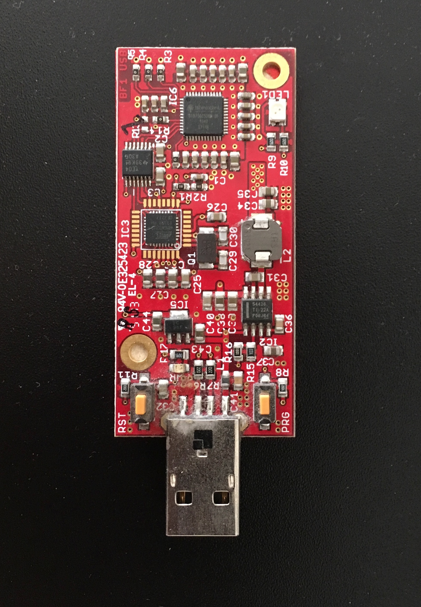
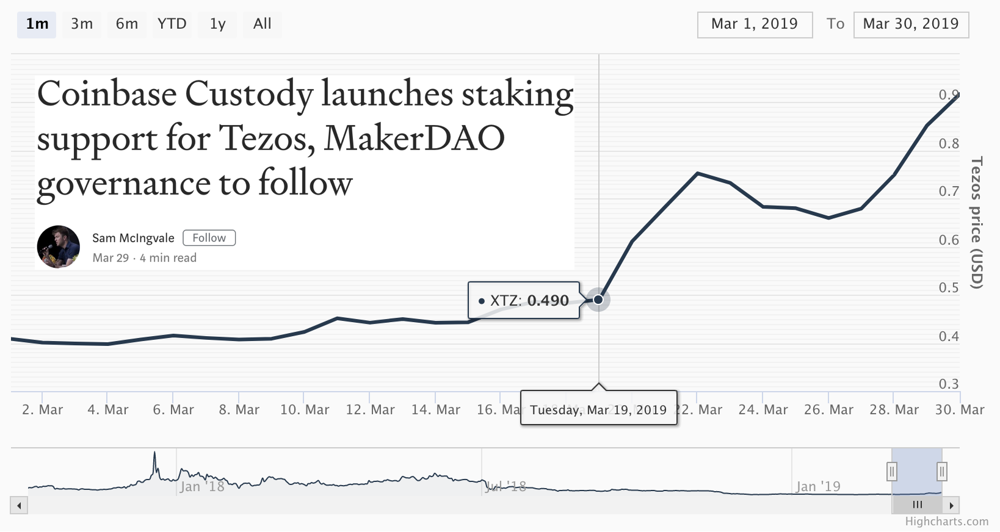

Title: What's for dinner Crypto?
Date: 03/30/2019

## When Crypto eats out, she orders Stake.
*(Or, it tastes better when someone else makes it)*

`(Photo by José Ignacio Pompé on Unsplash)`

In this exploration of a retail investment thesis for crypto, the latest offering
from companies hoping to capitalize on crypto for the masses is staking.
<a href="https://blog.coinbase.com/coinbase-custody-launches-staking-support-for-tezos-makerdao-governance-to-follow-68f7bc51bc53" target="new">Coinbase</a> 
has announced the offering of staking support for 
<a href="https://tezos.com/" target="new">Tezos</a>.
Tezos is a crypto currency project exploring governance on the
blockchain. <a href="https://tezos.com/" target="new">Tezos</a> uses staking as its consensus mechanism. The idea of staking is simply locking up an allotment of tokens for the right to rewards and extending the chain, which also supports the security of the network. The more tokens that are staked, by a diverse community of supporters, the healthier that network is deemed to be. The more tokens a participant locks up, the more often that participant is rewarded with the opportunity to extend the network. This is similar to the concept of proof-of-work mining in projects like
<a href="https://bitcoin.org/en/" target="new">bitcoin</a>. 
But it vastly differs in its security model (don't yell at me).

Choosing to participate in a blockchain project can be rewarding, and lucrative. In 2014 when many alt coins were traded on fly-by-night crypto exchanges, one of the only ways to get coins off-exchange was to build a node from the source code repository, run the node software, and send coins from exchange to the node wallet. The reason one would do this is because these exchanges kept shutting down and absconding with customer funds!

Of course this misses to point of being a good steward of a blockchain project, and running
a full node to increase the health of the network. But this too misses the original point of
running a <a href="https://bitcoin.org/en/" target="new">bitcoin</a> 
node from the very early days when it could be mined from a CPU, incentivizing users to run the software on local computers to gain more bitcoin. CPU mining gave way to Block Erupters, which gave way to ASIC miners. Quickly the only way way to mine crypto currency like <a href="https://bitcoin.org/en/" target="new">bitcoin</a>, was to use dedicated computers that
filled a warehouse.

`(Block Erupter: Bitfury BF1 Fury stick | 55nm ASIC chip | 2.2Gh/s)`

There was a time when individual operators could mine crypto currency from their basement
(I mined bitcoin with the above erupter from a hotel once. Why not use the free wifi and
electricity).

In the past bull cycle of crypto, before the ICO craze of 2017, projects would pre-mine
their supply and dump these tokens on the market to make a profit. Mining operations were
used to pre-mine supply at the launch of a project, as it is easier to mine near the
genesis of a project when difficulty is low. Small mining was a big thing, and people
could make money doing it. With ICOs, the projects didn't need to mine the supply, they
could just program a number and have access to immediate supply, sell that supply at
a discount to early investors in a pre-sale, and then dump on the public. All of these
schemes end with an early group of participants dumping on the public. Hence the point
of all this writing, don't get dumped on as a retail participant in this space. This space
was made for the masses, and yet the masses still get taken advantage of.

What's the tangent for? Well, running node software can be beneficial. The trend now seems
to be the reintroduction of custodians back into the fold, by having large, heavily regulated companies,
manage your funds. It is an old model, but we seem to gravitate toward it (like a moth to
  a bug zapper). This new model of staking from blockchain 2.0 projects replace the mining
aspect of participating in the network, but not the participation part. With projects
like <a href="https://tezos.com/" target="new">Tezos</a>, 
users are incentivized to gain rewards, in the form of additional tokens, by staking an allotment of tokens to the network. This would be in the form of running a node and actively staking. Similarly with the concentration of mining
<a href="https://bitcoin.org/en/" target="new">bitcoin</a>, with 
<a href="https://tezos.com/" target="new">Tezos</a>, staking services
soon developed. These are companies that would pool together tokens from many users and
collectively stake the pool. There is a threshold for many of these staking projects,
one can participate in staking if she stakes a certain amount. 
For <a href="https://tezos.com/" target="new">Tezos</a>
the minimum amount to be able to stake is 10,000 tezzies. Bakers, as stakers are termed
in <a href="https://tezos.com/" target="new">Tezos</a>, 
can participate in staking if they stake a minimum of 10,000 tokens. This is where baking services come in, as not everyone has 10,000 tezzies (or tezos tokens), but you can delegate your tezzies to a baking service who will stake on your behalf. This allows for those who do not meet the minimum requirement an opportunityto participate in the rewards granted from staking on the network. This also provides for more consistent payouts (i.e. tokens rewarded from staking/baking).

This is what <a href="https://www.coinbase.com/" target="new">Coinbase</a> 
is now offering at an institutional level. Their clients can buy lots of tezzies on platform and keep them in cold storage with 
<a href="https://www.coinbase.com/" target="new">Coinbase</a>,
which will serve as the custodian. 
The client can then access the security and convenience of
<a href="https://www.coinbase.com/" target="new">Coinbase</a>'s 
custody solution without losing the opportunity to receive rewards from staking/baking their tokens. These rewards (mining terminology) are inflationary, as they increase the supply. So those holding (or hodling) tezzies are incentivized to stake, to gain rewards but also to protect themselves against the inflationary terms of the supply characteristics of project. The reasons a project wants to incentivize this behavior have to do with promoting decentralization (which is arguable with these custodian services), limiting
price volatility of the underlying token, but principally for <a href="https://tezos.com/" target="new">Tezos</a>, it supports their governance model. The staking participants in <a href="https://tezos.com/" target="new">Tezos</a>, the bakers, receive a vote in the governance of the project. The more that is locked up for staking the more weight the vote has. For baking services, in which you delegate your stake weight to a company that
stakes on your behalf, the service issues the vote on governance amendments. 
You lose your vote. Services advertise that they will vote on behalf of their delegates, but the vote is executed by the bakers 
(for <a href="https://tezos.com/" target="new">Tezos</a>).

The 
<a href="https://blog.coinbase.com/coinbase-custody-launches-staking-support-for-tezos-makerdao-governance-to-follow-68f7bc51bc53" target="new">Coinbase</a> 
release also includes an annoucnement that 
<a href="https://makerdao.com/en/" target="new">MakerDAO</a> 
will also be supported with their custody solution. And the article states that clients depositing these assets will be able to participate in voting on the respective projects. Both <a href="https://tezos.com/" target="new">Tezos</a> and
<a href="https://makerdao.com/en/" target="new">MakerDAO</a> 
have governance models that offer holders of those tokens the right to vote on issues proposed by the projects. It will be interesting to see how 
<a href="https://www.coinbase.com/" target="new">Coinbase</a>
solves this challenge. The article also details that 
<a href="https://www.coinbase.com/" target="new">Coinbase</a> 
will run their own nodes for validation and that assets will be held in cold storage. 
For <a href="https://tezos.com/" target="new">Tezos</a>, 
this means that the tezzies deposited will be stored in wallets that are not held on any computer that has an internet connection, and that these assets will be delegated to the 
<a href="https://www.coinbase.com/" target="new">Coinbase</a> 
validator nodes participating in the <a href="https://tezos.com/" target="new">Tezos</a> network.  But it remains to be seen how each client will be able to participate in voting. The solution will probably be an internal tally that is aggregated into a yes or no
vote for a prospective amendment, but that remains to be seen as details are forthcoming.

For now I will continue to run my local 
<a href="https://tezos.com/" target="new">Tezos</a> 
node purely as a nostalgic reminder of the days when 
<a href="https://bitcoin.org/en/" target="new">bitcoin</a> 
could be mined with a laptop and a powered usb hub of Block Erupters. Participating in a project by running local software and voting in their governance models should matter, and have impact. But most participants of these projects don't vote. People are busy and time is scarce. Custody solutions, that are insured and compliant with stringent regulatory standards, offer a convincing option for those who want to play, but don't have the time, patience, or pure stubbornness to figure out how to build and run these applications. But for those who can and do manage to participate in these projects before enterprise solutions are available, they may be rewarded for their efforts.

`(Chart by https://messari.io/onchainfx which seems to use https://www.highcharts.com/)`

*disclaimer: these musings are offered, at best, as educational, and at worst for entertainment purposes. Do not take action on the descriptions above, as they contain risks, and are not intended as financial advice. Do not do anything above.*    
