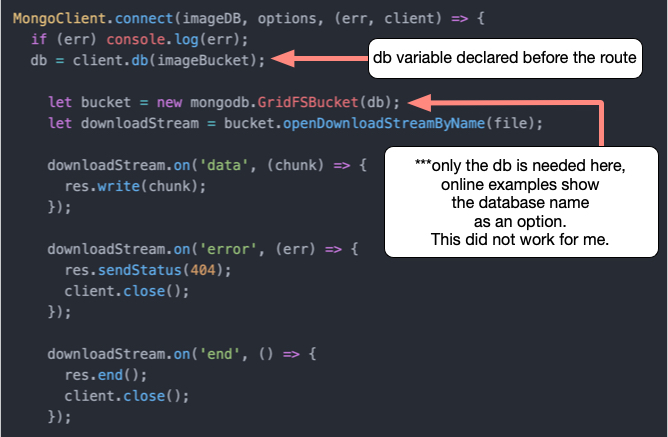

Title: Mongo Image Database
Date: 08/15/2020

## I say Mango you say Mongo (for images)

`(Photo by Avinash Kumar on Unsplash)`

I recently looked into how MongoDB can facilitate storing and
retrieving images, and had some difficulty implementing the
examples I found online. Here is the solution I came up with
to serve as hopeful help in the future for me or anyone else.

### Background

MongoDB is primarily a document database, not designed for larger
files, so CRUD operations for files over 16MB is not supported.
Mongo's solution is GridFS, a dedicated mongo database structure for
larger files. This is more of a bucket to dump large files, which is
split between two collections, one which stores the file's metadata,
while the other, the binary data source.

It took a bit of poking around but I was able to get an image database
working with MongoDB using GridFS. Because the setup was a bit confusing,
and I was unable to find a working example with the latest version of Mongo,
I am going to detail the solution I used, in an effort to help someone else,
but primarily as a historical document that I can refer back to if I ever
need to do it again!

### The Solution

The version of mongo may change how this is implemented. But this solution
currently working for version 4.

Mongo will use a separate database for images that will use their GridFS
layout. The GridFS database has two collections, *chunks* and *files*, where *chunks* stores the files' binary chunks and *files* stores the files' metadata, e.g. the files' name (more info <a href="https://docs.mongodb.com/manual/core/gridfs/" target="new">here</a>).

To begin, a new database needs to be created with user permissions for that GridFS database. Setting up a new database called *bucket* with a user called *bucketUser* that has *readWrite* permissions, will allow images to be stored
and retrieved from *bucket*.

On the server side files can be stored into *bucket* with a command line
interface called *mongofiles*. The downside of using *mongofiles* is that
the password seems to be passed in the clear on the command line.

Authenticating writes to this bucket db may be better suited for MongoDB Compass,
or your own build admin panel, else be sure to clear the bash
history from the terminal before logging out of an ssh session.

```bash
cat /dev/null > ~/.bash_history
```
*from
 <a href="https://askubuntu.com/questions/191999/how-to-clear-bash-history-completely#192001" target="new">
askubuntu</a>*

Next I added a couple test images to the bucket with the following command:

*assuming user is bucketUser and the db is bucket*

```js
mongofiles -u bucketUser -p 123456 --db bucket put image.jpg
```

Using the command `put` will save the file *image.jpg* to the *bucket*
database.

Once the bucket is set up, and there are a few files to test in it, we
can move on to the challenge of retrieving them.

Getting access via an api for the image database was a bit of a challenge,
that I hope to avoid in the future. The first trick is that the express
mongoose driver doesn't support GridFS, (*or at least it doesn't appear
to, but if so use that because that would be easier*).

To access the GridFS database from an express application the official
<a href="https://www.npmjs.com/package/mongodb" target="new">mongodb</a>
 driver for Node.js is needed.

Install the *mongodb* driver for the Node application.

Then we will need to construct a *MongoClient* with:

```js
const mongodb = require('mongodb');
const MongoClient = require('mongodb').MongoClient;
```

we also want to declare our database information:

```js
const imageDB = config.get('imageDB');
const imageBucket = config.get('imageBucket');
```

as well as some options for the db connection:

```js
const options = {
  useNewUrlParser: true,
  useUnifiedTopology: true,
}

let db;
```

Then, within the route declaration we will use *MongoClient* to connect
to the database:



Note that online examples declare the variable bucket as follows:

```js
  let bucket = new mongodb.GridFSBucket(db, {
    bucketName: 'photos'
  });
```

This did not work for me. The above code example, however, does work.

Most of the download stream references are boilerplate which comes from
other examples, and the driver <a href="http://mongodb.github.io/node-mongodb-native/3.6/api/" target="new">documentation</a>.

This is the declaration for an express *get* route for retrieval. There are
other examples available to implement a *put* route, but I only needed a
get route, so this example demonstrates only that.

The full code example is as follows:

```js
const mongodb = require('mongodb');
const MongoClient = require('mongodb').MongoClient;
const config = require('config');
const express = require('express');
const router = express.Router();

const imageDB = config.get('imageDB');
const imageBucket = config.get('imageBucket');

const options = {
  useNewUrlParser: true,
  useUnifiedTopology: true,
}

let db;

// get an image file by name
router.get('/name/:filename', async (req, res) => {
  let file = req.params.filename;

  MongoClient.connect(imageDB, options, (err, client) => {
    if (err) console.log(err);
    db = client.db(imageBucket);

      let bucket = new mongodb.GridFSBucket(db);
      let downloadStream = bucket.openDownloadStreamByName(file);

      downloadStream.on('data', (chunk) => {
        res.write(chunk);
      });

      downloadStream.on('error', (err) => {
        res.sendStatus(404);
        client.close();
      });

      downloadStream.on('end', () => {
        res.end();
        client.close();
      });

  });

}));

module.exports = router;
```

And that is it. A bit tricky to get the db instantiated, but once that
is solved, the rest works as the api documentation states.

The next challenge is building an admin dashboard for CRUD operations. But
I will leave that for the future.

*disclaimer: these musings are offered, at best, as educational, and at worst for entertainment purposes. Do not take action on the descriptions above, as they contain risks, and are not intended as financial advice. Do not do anything above.*
