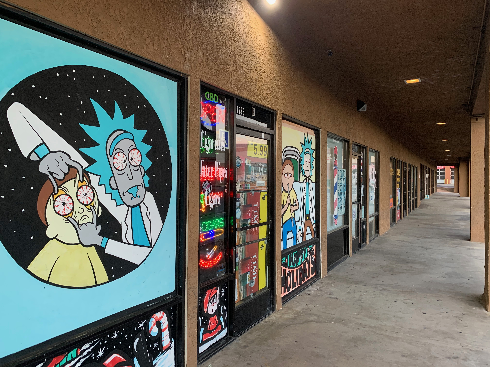
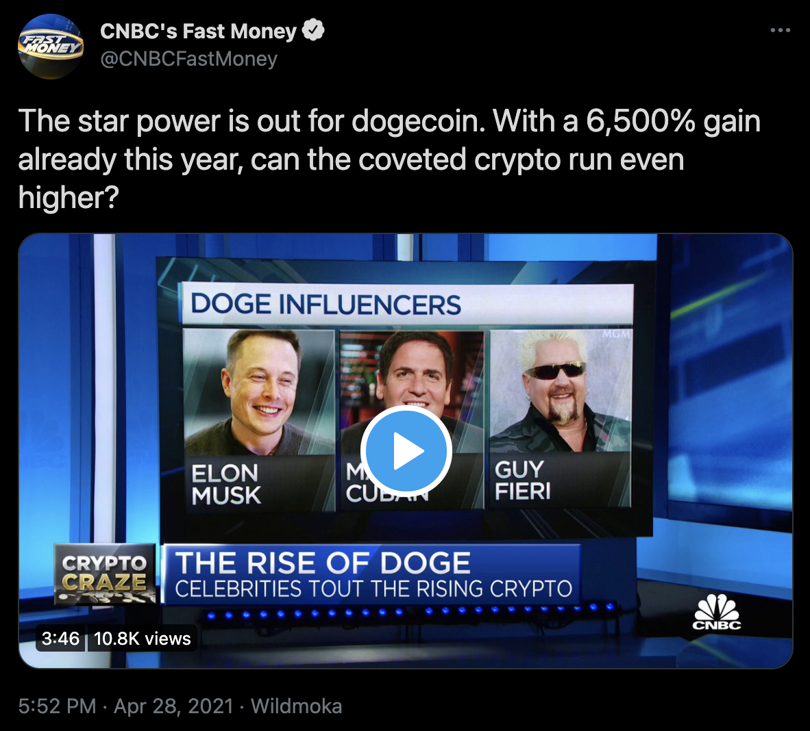
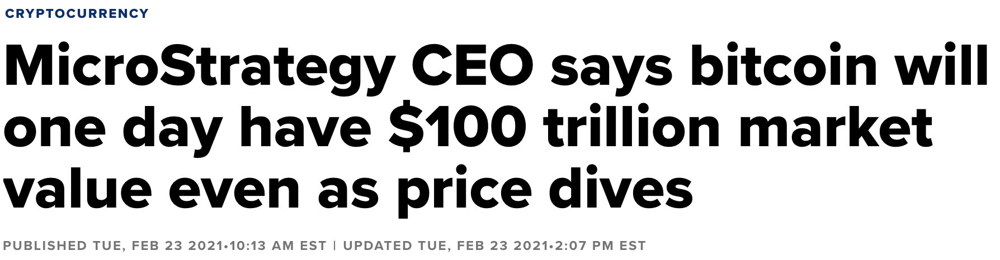
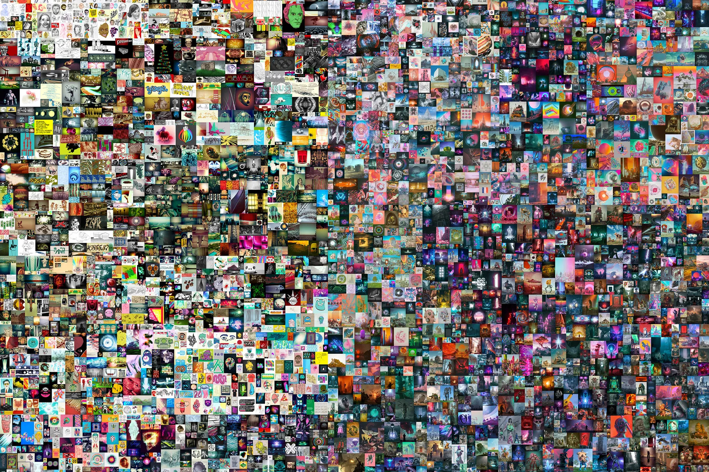

Title: State of the Crypto Union
Date: 05/01/2021

## The State of the Crypto Union

### DeFi, NFTs, and Derivatives, oh my!

In an effort to remember how to update this blog,
and to keep this area somewhat active, it is perhpas
a good idea to reflect on the current crypto space
as the middle of 2021 approaches.

Sell in May and go away doesn't seem to be the case this
year as, checks the price charts, Ethereum is posting
a new ATH and Bitcoin is bouncing back from oblivion. 2020
was the shitshow of the century as the world devolved
into the coronavirus pandemic, which we are still reeling
from socially, fanancially, politically, and unfortunately from
India's perspective, the pandemic continues.

But what are people to do when locked inside for a year, while
getting stimulus money from the government. Well, we get a
crypto bull run to rival 2017. It wasn't completely organic as
there was help from the <a href="https://www.reddit.com/r/wallstreetbets/" target="new">WallStreetBets</a> crowd, Elon Musk,
Mark Cuban, and apparently Guy Fieri.

But the tides changed with Michael Salor of MicroStrategy's purchase
and continual proselytization of Bitcoin as an institutional asset.

<a href="https://www.cnbc.com/2021/02/23/microstrategy-ceo-michael-saylor-sees-bitcoin-100-trillion-market-value-one-day.html" target="new">Article</a>

### DeFi
But DeFi has been gathering steam for some time. <a href="https://uniswap.org/" target="new">Uniswap</a> became the
ultimate winner, which broke the gas fee market for transaction fees. 
There was also a mighty fruitful go of yield farming, which isn't going away, but did solidify my crypto thesis of passive investment. People are keen to earn a yield on their assets, and are willing to
take a risk to lend those assets out to do so. But this was somewhat
obvious, people do this with non-crypto assets, however as rates have
dropped, crypto markets have become ever attractive. In the old days, one could provide liquidity to centralized exchanges for their customers to borrow on margin. Who hasn't lost money from doing that
amirite???

The exciting developments were also ETH 2.0 staking and Layer-2 rollout from many projects. DyDx went with <a href="https://medium.com/starkware/dydx-now-on-mainnet-c21c84d8e342" target="new">StarkWare</a> and Aave went with <a href="https://www.gemini.com/cryptopedia/polygon-crypto-matic-network-dapps-erc20-token" target="new">Polygon</a>. There are more projects expected to launch later in 2021, one of which <a href="https://www.smartpiggies.com/" target="new">SmartPiggies</a> is building on, also exciting. This is the best bullish case for Ethereum in the author's humble opinion, more so than ETH staking, which turned out to
be quite a fizzle. 

### NFTs NFTs NFTs
Perhaps the biggest event from the NFT movement during 2021 was the $69 million sale of 
<a href="https://www.theverge.com/2021/3/11/22325054/beeple-christies-nft-sale-cost-everydays-69-million" target="new">Beeple's</a>
"Everydays - The First 5000 Days" by Christie's pictured below.

Wait, how did you get it, you don't own that?! Don't ask, but someone does own it and that's the point. Perhaps another post will wrestle with ownship and digital art, which many have explored well before NFTs. You can't buy a 
<a href="https://www.forbes.com/sites/tommybeer/2021/03/11/pipe-smoking-alien-cryptopunk-nft-sells-for-75-million/?sh=4247f8fb5c56" target="new">crypto punk</a>
for less than a car, or a mansion, and everyone wants a piece or a pipe (see link).

NFTs and gaming will explode soon; arguably it already has, but it hasn't quite hit the mainstream. Many could have retired (some have) off of an aggressive accumulation of AXS at 40 cents before its recent trip to the moon. <a href="https://axieinfinity.com/ " target="new">Axie Infinity</a> is a fun game that has been doing quite well, and has launched their layer-2 solution to bring down the transaction fees for their gaming system. They are developing an entire ecosystem of game play. This and other gaming platforms in the space are sure to crack the crypto-gaming dilemma.

We have come a long way from
<a href="https://www.cryptokitties.co/" target="new">cats</a>,
which consequently the company who created crypto kitties, Dapper Labs is now a multimillion dollar company after their NBA 
<a href="https://abcnews.go.com/Entertainment/wireStory/dapper-labs-creators-nba-top-shot-305m-funding-76767162" target="new">Top Shot</a> collaboration. Everyone is making money but us. Well, there is always derivatives.

### Derivatives, and other DeFi primatives
Derivatives seems to have been made for crypto, or maybe that is reversed. As more money floods into the cryptoscape, more projects are coming up with more ways to stack legos and derive value. SmartPiggies is shooting to be out this year on Layer-2, and there is a smorgasbord of derivatives available to the decerning, and non-decerning crypto pioneer. There is a lot of compitition in the options space, as a few early projects have secured funding, as well as many flash loan fails (and successes, depending on your perspective), arbitrage opportunities, sniping, front running, sandwhiching, and altogether wild west mayhem. 

There have been a fair share of centralized and decentralized exchanges cropping up, garnering market share, and we got Ethereum futures on the CME in 2021. Still no Bitcoin EFT, because, well, who knows `¯\_(ツ)_/¯`?!

There is a lot of staking going on, and staking of borrowed assets, that are lent, and borrowed, and lent again. This recipe for success can only end well. But, very profitable while the music is playing.

### Wrap it up
The future is exciting, and the cryptocurrency space is only going to grow from here. There will be a reconing at some point with derivatives and liquidity, but it isn't today, and it won't be tomorrow. But with the world eating its own tail, it is fitting that this shows up in crypto as well. Crypto will survive any perturbations, as there is too much development and innovation happening. It ain't going away. It is what you put into it, perhaps, and means different things to different people. And it is always fascinating to look back at where we started, where we are, and where we are going. Let's see what the summer holds, or hodls!

*disclaimer: these musings are offered, at best, as educational, and at worst for entertainment purposes. Do not take action on the descriptions above, as they contain risks, and are not intended as financial advice. Do not do anything above.*

