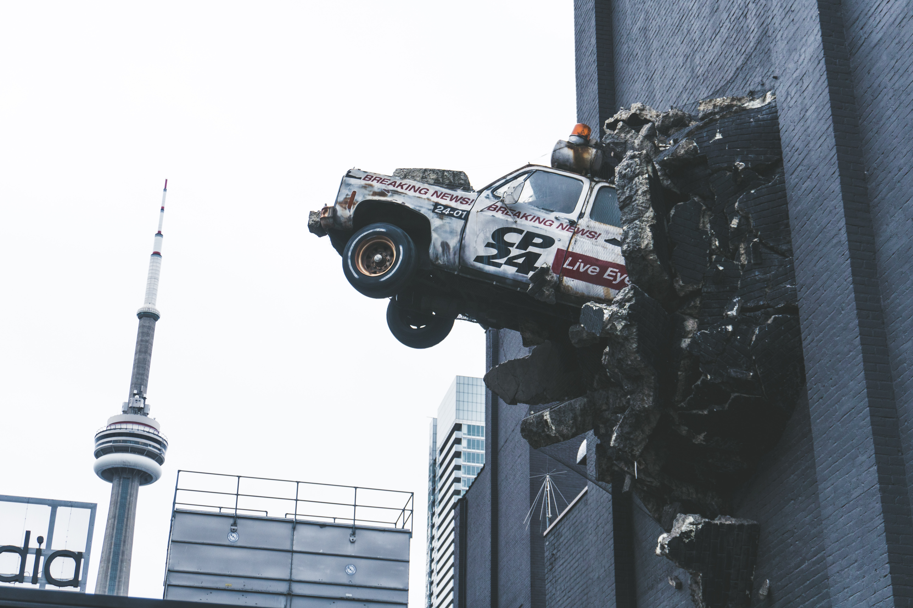
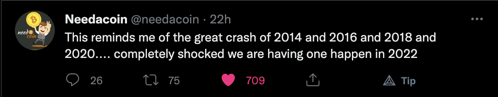
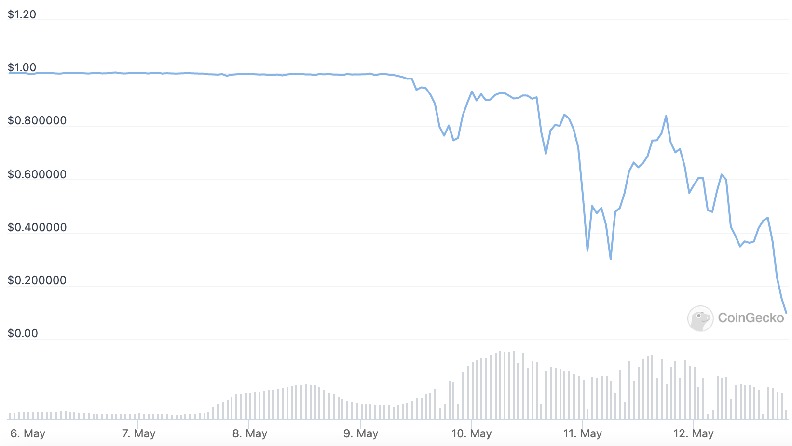
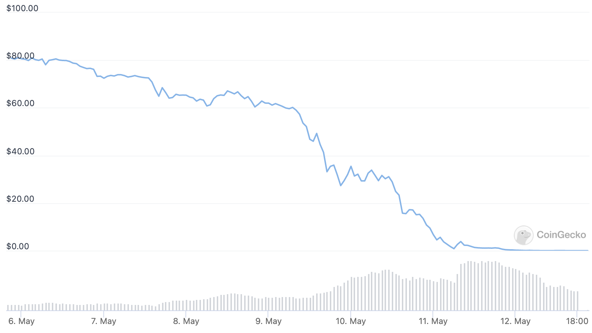

Title: Crypto Crashing...Again
Date: 05/12/2022

## Crypto Crashing...Again

| Photo by Conor Samuel on Unsplash |

Could be the name of a song, but alas it is just crypto being crypto. This time with moar flare than usual...or just the same ole same ole thang.

from <a href="*disclaimer: these musings are offered, at best, as educational, and at worst for entertainment purposes. Do not take action on the descriptions above, as they contain risks, and are not intended as financial advice. Do not do anything above.*">@needacoin</a> on twitter.

This post isn't going to go over the details of how this recent crash percipitated and erupted, although they all seem to rhyme, and it goes something like a big, loud, boisterous project, garnering a lot of attention, by promising quick riches, spectacularly crumbles, publically, brutally.

The last I can remember was bitconnect (go look it up). This time is was the great fear of DeFi, a depeg, Terra's stablecoin TerraUSD.

  

courtesy of <a href="https://www.coingecko.com/en/coins/terra-usd">coin-gecko</a>

Needless to say, TerraUSD is supposed to be redeemable for one US Dollar. This massacre also took down Terra's utility token Luna.

courtesy of <a href="https://www.coingecko.com/en/coins/terra-luna">coin-gecko</a>

Your eyes do not deceive you, that price was $80 just days before the percipitous fall. 

This was a lot of monetary destruction. Twitter was afloat with stories of people losing their life savings, and some reportedly committing suicide. A very serious matter. This played out very much the same way during the last crash, and the crash before that.

The purpose of this post is to consider what next. The market is down heavily, and crypto is dead. Until it isn't. This has happened, as noted above, four previous times, and will most likely happen again...and again. 

## So, what now?
 
Well, this is a great time to reposition for the next bull run. This blog's author sees it as the time to move funds around, pick up deals, and position for the next cycle. Will there be another bull run though? Of course there will be. When? Who knows, I am no fortune teller (although there seem to be some on crypto twitter). But, unless the world is over, there will be another cycle of growth. 

But what about the energy cliff, and peak energy. And the economy, inflation, supply chain disruptions, World War III, or IV?! 

Yes, all concerns. But we must continue onward. So, what now?

It could be a good time to move things around. When everyone is done slamming the network to sell are their bags before their neighbor, the mempool and transaction pool will be less congested. That is a great time to move stuff around. All those ideas one had, but looked at the transaction fees and didn't do it. Well now is the time.

Do we all have our coins off exchanges, on hardware wallets, or cold storage??? It is probably prudent to do that now. Get a <a href="https://www.ledger.com/">ledger</a>. Still running around showing off your NFT PFPs on your mobile wallet? Maybe it is time to get a <a href="https://keycard.tech/">keycard</a>? Make the moves for, what could possibly be, a long crypto winter, well summer-into-winter.

Pick up some cheap stuff. Everyone loves a clearance sale. It could be a good time to tip-toe into some projects that looked intersting. There is no rush to do this, of course, prices will be destressed for months. But, the projects with a war chest of cash, and good ideas, will probably be around and continue to pursue their roadmaps. It might be a good time to look into those. Or add to some projects that are interesting, just as a bookmark to research further.  

It could also be a good time to do all the things that you wanted to, but were waiting for the right time. Well? Ain't gonna get better than now. Or, well, it could, but probably not much better. A good evaluation of the landscape, a look left, a look right, measuring, and positioning could pay off in the mid-term future.

Once done, and satisfied that you won't miss that perfect entry, turn off the computer, and pursue that hobby you've been meaning to do! At this point, I am just telling myself to go outside and enjoy the weather!!

After the crypto crashes, people tend to go heads down and make things. That's what this blog post is most about. Protect what is still available, position for a positive outcome in the future, and put it on cruise control for awhile. I am very excited by some of the projects I have learned about this year. For the next couple months, years o_O (!), it is probably a good time to make stuff, cool stuff, stuff people can use.

The world is crazy, and seeming to get crazier. I hope everyone held on through this crazy, crypto, bash, flash, trash, crash. And just to be clear, none of the above should be construed as investment advice, because it is not! The above are musing of potential positive steps to take advantage of opportunities that may be available given the recent sell offs. Make wise choices, be well, and do something that you enjoy! Also not investment advice!!

Photo by Jon Tyson on Unsplash

*disclaimer: these musings are offered, at best, as educational, and at worst for entertainment purposes. Do not take action on the descriptions above, as they contain risks, and are not intended as financial advice. Do not do anything above.*
