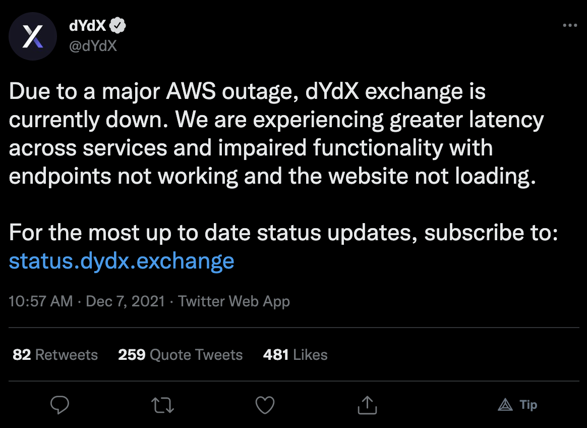
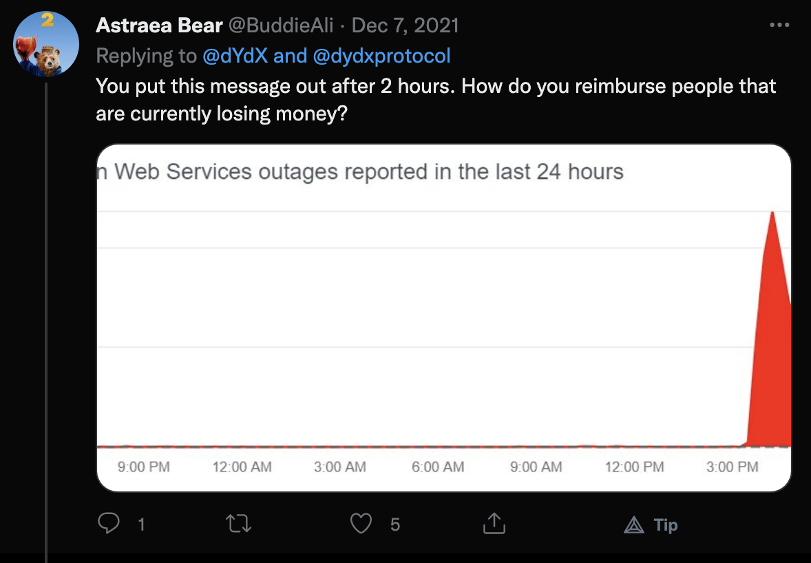

Title: DeFi means democratizing finance
Date: 05/25/2022

## DeFi means Democratizing Finance

Photo by Marija Zaric on Unsplash

Post DeFi summer, we are apparently in DeFi autumn(?), which suggests we are heading into DeFi winter? Or perhaps we went from DeFi summer to DeFi winter, and skiped the fall. Or is the fall so percipitous that we just end up immediately in winter? 

### Decentralized Finance

DeFi, a blending word created from contracting *decentrailized finance* had quite the run in the summer of 2020. It was the coming of age of DeFi, a concept that had been known before 2020, but solidified during that year. <a href="https://finematics.com/history-of-defi-explained/" target="_blank">finematics</a> has a nice summary of the events. The summer of 2020 defined DeFi as a force in the blockchain world.

It was the quintessential coming of age romcom of the nerd in high school that finally gets to be popular, that old trope. But it seemed to be true, DeFi was a force, and it was turing heads. Why? Because of the TVL.

### It's all about the TVL

Total value locked, is the ultimate measing stick in DeFi. "How much TVL does you protocol have, bro?," became the replacement for "what kind of car do you drive?" Or:
	
	"what do you do?"
	"I'm a DeFi degen"
	
It was all about how much value was locked up in a smart contract, and there was a lot locked in some of these contracts. And it was good, and people were happy. And then the honeymoon period began to fade. There were hacks (of course, there always are, and always will be), rugpulls, and denial of service (intentional and unintentional). 

As in all things, the happy times soured, and the criticism began, or perhaps became loud enough to be heard. One of the biggest criticism in the DeFi space was, well decentralization. From accessability to censorship resistence, many DeFi protocols and the dApps did not seem to be very decentralized.

From a regulatory persepctive, the company's developing and maintaining these protocols seemed to be susceptible to regulatory censorship, a government entity being in a position to shut down the projects. From a similar accessibility standpoint, the dApps that were allowing users to engage with these protocols seemed to run on mostly centralized infrastructure. DyDx, one of the higher volume DeFi exchanges suffered accessibility issues when AWS went down on Decemenber 7th, 2021:

<a href="https://twitter.com/dYdX/status/1468293558360805381">tweet</a>

And a response from <a href="https://twitter.com/BuddieAli">@BuddieAli</a>:

<a href="https://twitter.com/BuddieAli/status/1468294444294283274">tweet</a>

This "raised concerns over its decentralization" from <a href="https://www.investing.com/news/cryptocurrency-news/aws-outage-hits-dydx-raising-concerns-over-its-decentralization-2707987">investing.com</a>. But the sentimate was industry wide. 

In addition to infrastructure criticism about DeFi, a concern over regulatory vulnerability was also raised when the SEC began sabre rattling and enforcement action during the summer of 2021. This began in earnest witht the appointment of the new SEC chairman Gary Gensler, as <a href="https://decrypt.co/76511/sec-chairman-gary-gensler-lawsuits-stock-tokens">decrypt.co</a> notes.

This prompted, perhaps one of the other largest DEXes, Uniswap to self regulate. With the SEC targeting "stock tokens," Uniswap began to remove tokens from its trading platform. <a href="https://decrypt.co/76793/ethrereum-dex-uniswap-drops-tokenized-stocks-as-regulators-close-in">decrypt.co</a> 

Uniswap had already taken steps to decentralize ownership in the protocol with its UNI token distribution to protocol users on September 16th of 2020. <a href="https://www.coindesk.com/business/2020/11/03/uniswaps-retroactive-airdrop-vote-put-free-money-on-the-campaign-trail/">coindesk.com</a>

Even with a governance token, distributed ownership, Uniswap still felt the pressure from regulators. 

### DeFi should mean democratizing finance

DeFi's power isn't necessarily in its decentralization, it is in its democratization, and the contraction should really stand for demotratized finance, not decentralized finance.

Everyone wants decentralization, in theory. Decentralization is useful, and desirable. It allows for censorship-resistant technology that is more resiliant than centralized models, but, and there is always a but...but it comes at a cost to performance. Users want a decentralized product, a web3 product if you will, the "feels" like a web2 experience.
Well, good luck with that, because web2 tech has been under continuous optimization since the 1990's, and that is a lot of time to optimize.

And how was all this optimization achieved? Through siloing services...the cloud. Projects can make decentralized, web3 products, but they won't operate like web2 products, and they won't have near the performance. We can argue with the push toward computation at the edge, to facilitate high performance applications such as VR and ML processing, web3 may become more performant. But in the interim, at best, decentralized, web3 platforms, and products, are going to be a blend of decentralized and centralized infrastructure. With this limitation we should be thinking about DeFi as a democratizing power, not necessarily as a decentralizing power.

### Democracy for the win

DeFi as democracy is achievable. Democracy didn't work out too well for ancient Greece, but perhaps this is our second chance at empowering the world with a semi-decentralized, publically available technology, that allows most to participate. Without the pressure of complete decentraliziation, DeFi can concentrate on reaching people, users that can benefit from these technologies. It may just be the case that a distributed, democratic financial system may be a better fit for everyone, rather than for providing exponential gains for the few.

With robust social and communication networks, democratized finance can be a powerful tool for inclusion, which facilitates trade, and markets for a global population, rather than a rigid, topology of of spotty participants. 

Decentralization is the goal, but perhaps until we get there, we can have a healthy, inclusive, democratized financial system, with users from every part of the world. This could be a distributed, public, network where everyone has an opportunity to play, imagine.  

Photo by James A. Molnar on Unsplash

*disclaimer: these musings are offered, at best, as educational, and at worst for entertainment purposes. Do not take action on the descriptions above, as they contain risks, and are not intended as financial advice. Do not do anything above.*