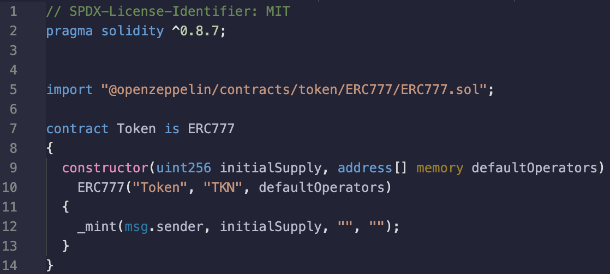
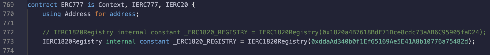
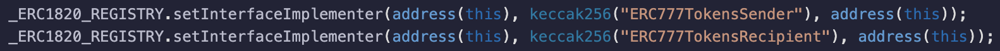

Title: Lucky number 777
Date: 05/10/2022

## Lucky number 777

Photo by <a href="https://unsplash.com/@imsimplysamuel?utm_source=unsplash&utm_medium=referral&utm_content=creditCopyText">Samuel Branch</a> on <a href="https://unsplash.com/s/photos/lucky?utm_source=unsplash&utm_medium=referral&utm_content=creditCopyText">Unsplash</a>

## Working with the OpenZeppelin ERC777 contract

This is a quick post about working with the ERC777 smart contract implementation from <a href="https://docs.openzeppelin.com/contracts/4.x/erc777">Open Zeppelin</a>. The other token contract implemenations from Open Zeppelin are somewhat straight forward to work with, namely the ERC20 and ERC721 contracts, however, the ERC777 contract implementation takes a bit of love before it can be deployed and played with.

## What's the problem

The ERC20 and ERC721 contracts can be deployed without any fuss, as they only depend on their import statements. Which if available will result in a deployable contract. However, because the ERC777 standard interacts with the ERC1820 Regsitry contract, an ERC777 contract will revert when deployed if a Registry is not available on the network. If you are working on a local network, then your contract will fail to deploy (and you will spend a couple hours trying to figure out why a vanilla contract won't deploy). The following is a manual approach to get an ERC777 working on a local test network. Note, that the ERC1820 Registry contract is available on most major testnets, so if working with one of those, you should not have these issues.

## A bit of background 

As stated above the ERC777 needs to interact with the ERC1820 Registry contract. There are only one of these (presumably) on a given network, which is hardcoded on line 32 of the Open Zeppelin implementation of the ERC777 <a href="https://github.com/OpenZeppelin/openzeppelin-contracts/blob/3bdf4bfd29b145288ec741bef259a384007ed5cf/contracts/token/ERC777/ERC777.sol#L32">contract</a>.

```
IERC1820Registry internal constant _ERC1820_REGISTRY = IERC1820Registry(0x1820a4B7618BdE71Dce8cdc73aAB6C95905faD24);
```

We see that on every network there exists (or should exist) a Registry contract at the address: 0x1820a4B7618BdE71Dce8cdc73aAB6C95905faD24.

What does you Registry do? 

It keeps track of supported interfaces for contracts. That means, by calling this Registry contract, a contract can know what interfaces are supported on another contract. 

Why does ERC777 do this?

Well, without going through all the calls within the ERC777 contract, eventually we get to a function named `_callTokensReceived()` on line 488 of the <a href="https://github.com/OpenZeppelin/openzeppelin-contracts/blob/3bdf4bfd29b145288ec741bef259a384007ed5cf/contracts/token/ERC777/ERC777.sol#L488">contract</a>.

The purpose of this function is to revert and roll back execution if someone (or any contract) tries to send tokens to a contract that doesn't support receiving tokens. One of the main benefits to this is avoiding a principal grievance with ERC20 tokens, sending tokens to the ERC20 contract itself, thereby locking those tokens in the deployment contract forever. With this approach, ERC777 does a check to make sure the receiving contract is registered to receive tokens.

We can see from the conditional inside the `_callTokensReceived()` function:
```
if (implementer != address(0)) {
  IERC777Recipient(implementer).tokensReceived(operator, from, to, amount, userData, operatorData);
} else if (requireReceptionAck) {
  require(!to.isContract(), "ERC777: token recipient contract has no implementer for ERC777TokensRecipient");
}
```

What does this say? Well it says if there is an implementer contract declared, try to call the `tokensReceived()` function on that implementer contract, and if there isn't an implementer declared, the calling contract cannot be a smart contract (must be an EOA, externally owned account), else the whole transaction will revert.

There are a lot more details in there, but the purpose is just to get you/me (in the future) going with a deployed ERC777 contract, so you/I can play with it.

Knowing that the ERC777 implementation is going to be looking for a Registry contract, we will need one. As stated above, if you are deploying to a major testnet, e.g. kovan, there should be a Registry deployed, in which case the ERC777 should deploy just fine. But what about localnet?

We can just deploy our own Registry, and point our ERC777 at it. An important note here, we are going to change the ERC777 contract to point at an ERC1820Registry that we deploy. It is never recommened to change any of the OpenZeppelin implemenations be it inherited contracts or libraries. In a production environemnt, this Registry would already be deployed, and this step is not needed. In a local testing environment, however, this Registry will not be available, and cause some pesky problems.

As stated above, on line 32 of the ERC777 the Registry is hardcoded in the implementation. For these purposes, we are going to work with the flat file, and then change the hardcoded address.

## Steps to deploy 

The juicy stuff.

Create the main token contract as Open Zeppelin describes, it should look something like this (from remix):



Then in remix activate the flat file plug in. And then render the flat file version of the contract. This will explode all of the inherited contracts into one file.

With the flat file rendered, we are going to work with that locally. Around line 772, the Registry is hard coded:



As seen in the screenshot above, comment our that line, and past it on the next line with the hard coded contract address of the locally deployed Registry.

When did we deply the Registry? We didn't. So deploy the
<a href="https://etherscan.io/address/0x1820a4B7618BdE71Dce8cdc73aAB6C95905faD24#code">Registry</a> 
and paste the deployed contract address inside the parenthesis of the IERC1820Registry declaration.

With this done, you will be able to deploy the ERC777, which will register with this Registry upon deployment. Seems an annoying little detail in dealing with this contract, and not one easily found online. However, this should only be a snag if you are working locally. The only issue is that working locally is usually where everyone starts out.

## Other considerations

There are a few other gotchas in working with an ERC777, which will only be mentioned here, more as a reminder for myself, as a detailed investigation is too lengthy for this blog post. However, other considerations when working with an ERC777 are:

* Token transfers via the `send` directive will work just as using `transfer` for ERC20 tokens, but only for EOA addresses. If you try to use `send` with the receipient being a contract address, the transaction will revert unless the receiving contract is registered as an ERC777Receipient with the ERC1820Registry.
* When creating a contract to interact with ERC777 tokens, this contract needs to be registerd as a Recipient/Sender with the Registry, in the constructor like so:

 

Hopefully this is helpful to some others looking into this token standard, and hopefully it will serve as a useful reminder for me in the future!


Photo by Donald Giannatti on Unsplash

*disclaimer: these musings are offered, at best, as educational, and at worst for entertainment purposes. Do not take action on the descriptions above, as they contain risks, and are not intended as financial advice. Do not do anything above.*
         