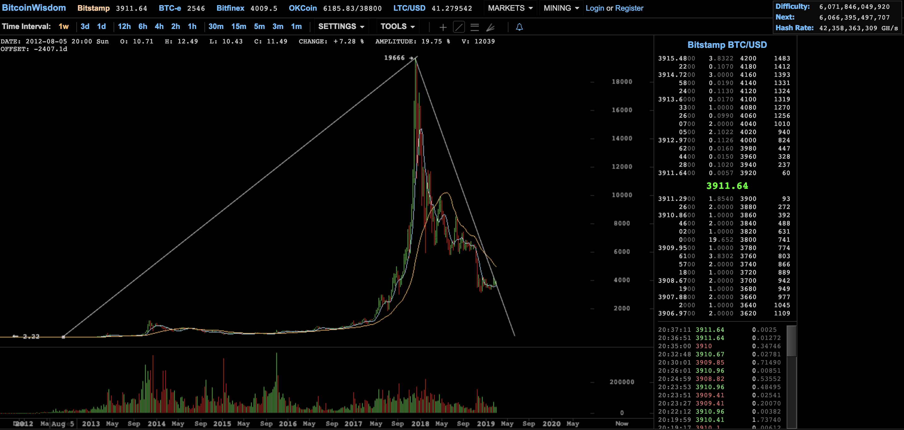

## A case for crypto.

I am putting up this site as an internet reference for my ideas,
and as a collective catalog of work. In doing so, the first blog
post seems to be the most difficult. So rather than posting a
casual introductory blog, I am going to outline my thesis of
cryptocurrency for retail investment.

This thesis is easier to identify today then when I first heard
of bitcoin, but we aren't quite there yet so there may still be some
details about this topic to explore. I first stumbled onto
bitcoin when it traded at $11 USD. I remember less the date and more the
price action. I can't remember what source pointed me to bitcoin, but
it was by way of the precious metal investment space. It could have been
the [Max Keiser Report](https://www.rt.com/shows/keiser-report/) (as
I used to watch that back in the day) or some other hard currency source.

As I look up a bitcoin price chart, bitcoin traded around $11 in November of 2012.
I didn't buy bitcoin at $11, however. As I followed the price, within
the week I was watching the price rose from $11 to $13, and I thought that
bitcoin was too volatile for me. (oh the irony)

*(bitcoin chart: line drawn from Nov. 2012 to the peak in Dec. 2017 and its
subsequent fall.)*
screenshot from <a href="https://bitcoinwisdom.com/" target="new">bitcoinwisdom</a>

I had invested in the stock market prior to the Financial Crisis of 2008.
I was in grad school during that train wreck, and the only thing I knew was
that I and most of the people I knew lost money from it. Which begged the
question, where did my money go? 2008 taught me a lesson about keeping money
in the stock market, but it also left me curious; where did all the money go?
Who had it?

Well, I still invested, I just shifted into hard assets. Gold, Silver, in hand.
That lead back to chasing yield in the stock market with junior resource miners.
I was late to that party.

I was very early to bitcoin though. Precious metals investing lead to following
bitcoin. I am a bit of a schizophrenic contrarian value investor, very conservative,
often taking a counter trade, but willing to take some risks. But I didn't invest
into bitcoin initially, I didn't see it as an investment at the time.

When I did start buying bitcoin, I was poor (and still am) so I couldn't really
afford to buy any real volume. What I could do, however, was buy alt-coins. Back
in those days, circa 2014, there was quite an online trading market in alternative
implementations to bitcoin, or forks referred to as "alts." I traded alt coins a
lot, it was fun, and it was addicting. This was a "stock" market, these were projects
that had representational value in quantifiable units that could easily be traded through
online exchanges.

For me, this was the same as trading stocks on [Scottrade](https://www.tdameritrade.com/scottrade.page),
the online brokerage I used, now TD Ameritrade (things change).

There was a difference to using an online broker, trading was faster, and the
volatility was bigger. The speed at which things changed in crypto was so fast.
New project could be created, marketed, and traded quickly. Most projects were
cloned code of the bitcoin codebase, with some parameters changed. Lots of people
made lots of money. Even more people lost money. I mostly lost money, ha ha. But
it was fun, fast, and addicting. This seemed to be what trading stocks wanted to
be. It was borderline gambling (or it was just that); the casino was big, and
there were a lot of players.

The trading space was modeled after the financial markets, and the projects were
marketed like fortune 500 companies. Most of that time is gone. It evolved and
matured (perhaps not so much). But it changed. Most of it collapsed on itself, or
exploded from greed, fraud, FUD, and a supreme bear market in the bitcoin price.

The development didn't really stop, but then 2017 came along. With the price rise
of bitcoin came another wild ride, and more people along with it. Every time these
waves of participation, attention, and price rise crash into the crypto space, it
has this violent tendency to usher rapid change, and then collapse, again.

This most recent bull cycle of bitcoin and the broader cryptocurrency space has
further pushed the evolution of cryptocurrency as an investment case. I see the most
interesting developments in retail investment, but the institutional players are
trying to get in. With this past 2017 cycle, people traded cryptocurrency on exchanges
just as they did in 2014, but there was more volume, more money, and even more people.
It brought moar greed, more fraud, and more FUD. The past hype cycle also ended in
another supreme collapse in the price of bitcoin and the broader cryptocurrency market.

I've see three of these now. So I am waiting on the next one. It will probably bring
in the big money players. But these entities aren't very interesting as participants in
an emerging asset class. The big money players always have access to making more money.
What I find interesting, and what I am waiting for, is how retail participants achieve
access to these assets as investments. The power of cryptocurrencies, isn't that it
can make money for people who have money, but it allows access for people who can
access it. This could be a perpetual cycle of access by the haves, and the denial
of access for the have nots. But I am hopeful that access to public blockchains,
running on open networks, allows access for a retail investment class, and that
retail class can better their financial futures from this access. Blockchains are
not the panacea for poverty, but they could open up access to financial markets for
participants that have never had such access before in history.

I remain hopeful, and work toward that prospect in the near future.

   

*disclaimer: this is not to be taken as financial advice, or advice of any kind.*
