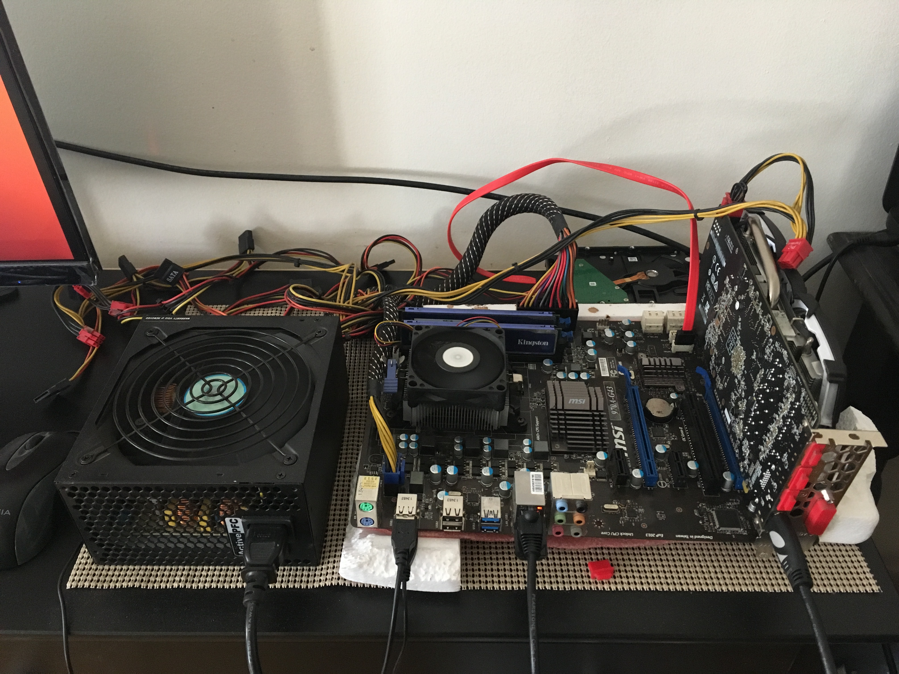
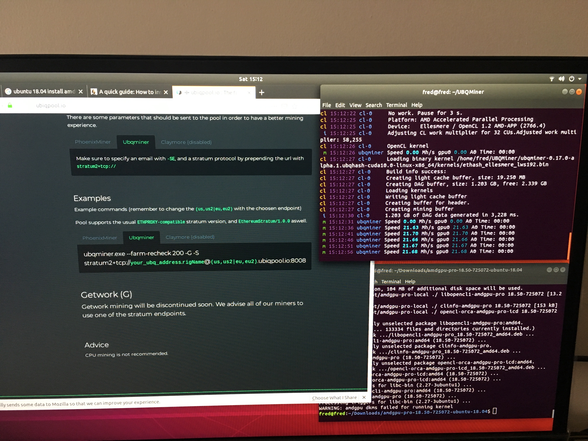
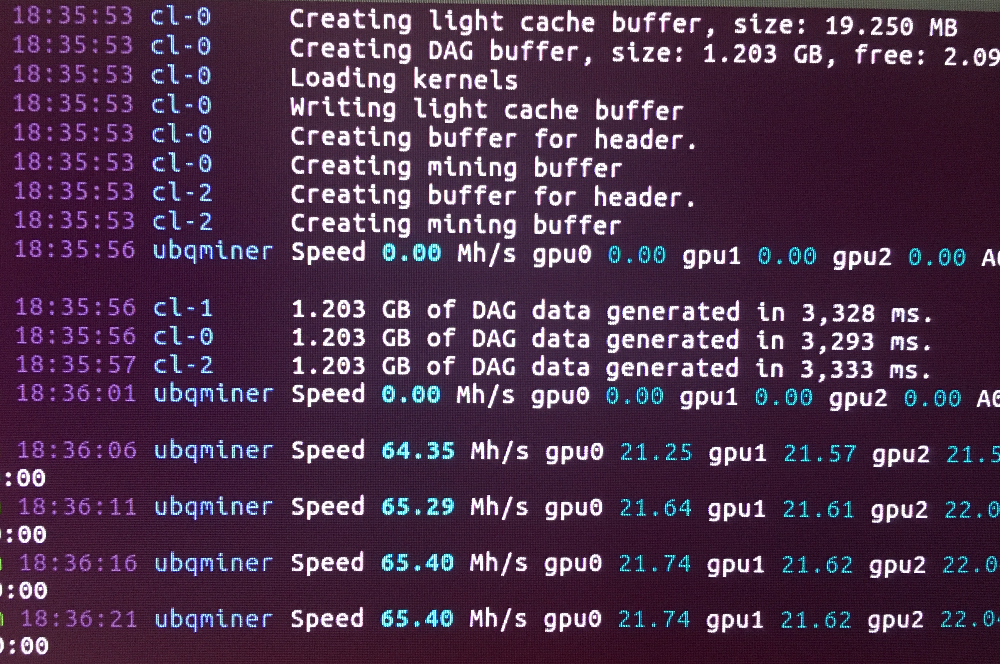

Title: Don't Mine(d) Me
Date: 03/31/2019

## Don't Mine If I Do!
*(What a pain in the a$$)*

`(Photo by Dominik Vanyi on Unsplash)`

Victory! Aaaaaaaand that was quite the exercise in futility.  

I had been asked to pick up my mining rig from the space it was operating in. Well,
it wasn't running anymore; it was just taking up space. I ran a small mining rig
that was mining [UBIQ](https://ubiqsmart.com/) for the majority of 2018.
It was a small rig (did I mention it was small), and over the course of that year it didn't
make very much in mining rewards.

*Note: mining rewards are taxable as income to US citizens*

<a href="https://ubiqsmart.com/" target="new">UBIQ</a> 
went through a hard fork in late 2018 to change their hashing algorithm to
<a href="https://blog.ubiqsmart.com/ubiq-quarterly-report-august-2018-f7451c2149c2" target="new">Ubqhash</a>. 
This meant that the current mining software used to mine the rewards for that chain would need to be updated. I can't remember what the issues were, but the platforms that were currently mining <a href="https://ubiqsmart.com/" target="new">UBIQ</a>
were no longer going to work. So I shut the rig down and it sat for a couple months. 
When I was asked to pick up all the gear, I thought it would be fun to setup the rig at my apartment and work through a proof-of-concept to get a new system up and running. Well, that turned out to be quite the adventure.

The goal was to get the 
<a href="https://github.com/ubiq/ubqminer" target="new">ubqminer</a> 
working on a Ubuntu installation. The incentive was fun, what was delivered was pain.

Skip down to *Here is what worked* to avoid all the complaining to follow.

This information is correct as of March 31st, 2019. As I quickly and repeatedly found out, most
of the information on the internet is often old, out of date, and creates confusion. The following is
a description of what worked for me. My hope is that this may help someone else, save their time,
their patience, and their hair.

Ubuntu 16.04 was always said to be an inferior platform for mining as the 14.04 fglrx drivers
were not supported. Ubuntu 18.04 seemed to be a better option. It is a newer build, surely the
gpu drivers must work. Make no assumptions.

I have three AMD RX570 GPU cards that I was planning to mine with. I began with a Ubuntu 18.04
build and downloaded the
<a href="https://www.amd.com/en/support/graphics/radeon-500-series/radeon-rx-500-series/radeon-rx-570" target="new">AMDGPU</a>
the RX570 drivers, which is a zipped file.
There are 
<a href="https://amdgpu-install.readthedocs.io/en/latest/" target="new">instructions</a> which list the process for
unzipping and installation. Of course there is an immediate issue, as there are variants that can, and
need to be, installed. The critical information is that this rig will use multiple cards and two of
the GPUs will run headless. Long story short, after hours, and days, of installing with the variants,
blowing up the system, looking at every AMDGPU issue online, adjusting the grub file, corrupting the
hard drive (many times), reinstalling Ubuntu, and repeating the process, I could never get Ubuntu 18.04
to run three AMD GPUs with
<a href="https://github.com/ubiq/ubqminer" target="new">ubqminer</a>. 
I asked for help in the
<a href="https://ubiqsmart.com/" target="new">UBIQ</a> 
Discord mining channel, which resulted in the advice of using a different
miner. I tried that, I built 
<a href="https://github.com/ubiq/ubqminer" target="new">ubqminer</a> 
from the source code, I tried more combinations than I can recall, and nothing worked. Very frustrating.

The main issues were with OpenCL not being installed, or not being available, resulting in
segmentation faults and dumping the core, to being able to mine with the main GPU, but the system getting
stuck with *AMD-Vi: Completion-Unit loop timed out* when the headless cards were plugged in. Not happy.

I am sure there are those who are mining with Ubuntu 18.04, and it would be nice to know what
combination of magic, ninja linux commands came together to allow their system to work. But there is
no incentive to give away the secret sauce. I did read a handful of mining guides, which I applaud the
authors for, but many were out of date, or using drivers I couldn't find. That is another annoying thing,
versioning. One set of drivers will be listed in a guide, but newer drivers are available. Which drivers to use?
Newer drivers should be better, and the forums state that the newer drivers fixed the previous issues.
Use the new drivers, those drivers don't work. :/

The furthest I got with 18.04 was mining with one card.

I eventually went back to Ubuntu 16.04.

### Here is what worked.

This is the system that I eventually got to mine multiple AMD GPUs, one seated in the
motherboard and two headless.

Install Ubuntu 16.04

Update the system.

`sudo apt udpate && sudo apt -y upgrade`

Download the AMDGPU-PRO drivers.

16.04 driver <a href="https://www.amd.com/en/support/kb/faq/gpu-635" target="new">instructions</a>:

<a href="https://www2.ati.com/drivers/linux/ubuntu/amdgpu-pro-17.40-492261.tar.xz" target="new">AMDGPU-PRO Driver Version 17.40 for Ubuntu 16.04.3</a>

Where ever that is downloaded (for me in ~/Downloads)

`tar -Jxvf amdgpu-pro-17.30-NNNNNN.tar.xz`

*(note the capital "J" in there)*

Change into that unzipped directory:

`cd amdgpu-pro-17.30-NNNNNN`

Install drivers:

`./amdgpu-pro-install –y`

Reboot the system:

`sudo reboot`

Not necessary but I did it:

`sudo usermod -a -G video $LOGNAME`

Install OpenCL:

`sudo apt install -y rocm-amdgpu-pro`

Set permanent link to clinfo:

`echo 'export LLVM_BIN=/opt/amdgpu-pro/bin' | sudo tee /etc/profile.d/amdgpu-pro.sh`

This doesn't work, but you can use the clinfo package:

`sudo apt install -y clinfo`

Set up Grub boot configuration so the system will boot when multiple cards are plugged in.

`sudo vim /etc/default/grub`

*(I use vim, nano would also work)*

Change the following lines:

`GRUB_CMDLINE_LINUX_DEFAULT="quiet splash"`

`GRUB_CMDLINE_LINUX=""`

to ->

`GRUB_CMDLINE_LINUX_DEFAULT="quiet splash amdgpu.vm_fragment_size=9"`

`GRUB_CMDLINE_LINUX="amd_iommu=on iommu=pt"`

Save that and exit the configuration file.

Make sure grub is updated for the reboot:

`sudo update-grub`

Shutdown the system and plug in the other cards.

Turn it back on and...

If it boots, check if OpenCL registers the cards:

`clinfo`

Hopefully all the cards are displayed...*hopefully*

Download <a href="https://github.com/ubiq/ubqminer/releases" target="new">ubqminer</a>:

<a href="https://github.com/ubiq/ubqminer/releases/download/v0.17.0-alpha.1.ubqhash/ubqminer-0.17.0-alpha.1.ubqhash-cuda10.0-linux-x86_64.tar.gz" target="new">ubqminer-0.17.0-alpha.1.ubqhash-cuda10.0-linux-x86_64.tar.gz</a>

Unzip that file. It contains the executable which can be run from within the folder
with the appropriate pool flags.

`./ubqminer --farm-recheck 200 -G stratum2+tcp://someUbiqAddress.rigName@us.ubiqpool.io:8008`

The above is a mish mash of a walk thru. For those who are familiar, the relevant
configuration for me was the grub config, and Ubuntu 16.04 with the ROCm drivers.

Success!

The purpose of the above is to speed up the process for someone else who wants to
tinker. But miner beware: this isn't profitable, nor worth the time, other than
to tinker. I have three GPUs running for a total hash rate of 65Mh/s. The current
top miner on 
<a href="https://ubiqpool.io/#/miners" target="new">Ubiqpool.io</a> 
has 4.52Gh/s and the last miners on the short list top out around 120Mh/s. 
At 21Mh/s per 4GB GPU, these miners have about 6 cards per rig. Getting to a Gigahash is going to involve a small warehouse.

I ran the rig for a few hours (maybe around four) and registered less than 1 UBQ in
rewards in that time. The fans on the cards are loud-ish and makes my room hot.
It isn't something I would casually keep running, not to mention when equipment fails
the rig goes down, and equipment fails all the time. I have four dead 1 TB hard drives
sitting at my feet, carnage from the process (they were dead from previous use).
As is always the case with mining, and something I learned long ago from past mining
pursuits, if you want cryptocurrency, just buy it. It is cheaper and easier to acquire by
outright purchase than by way of mining.

Enjoy your lambo!

    

*disclaimer: these musings are offered, at best, as educational, and at worst for entertainment purposes. Do not take action on the descriptions above, as they contain risks, and are not intended as financial advice. Do not do anything above.*    
